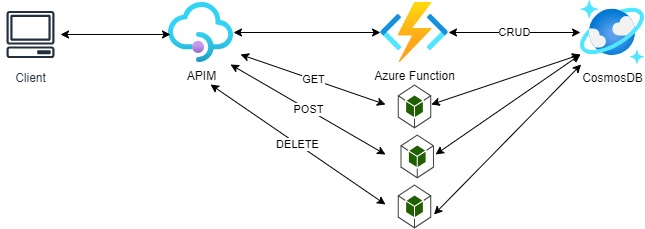

# Azure APIM Example

 - This assumes there is already an AZ Account and a Resource Group (put the RG name in the variables.tf)
 - Run a `terraform init`
 - Run `terraform plan` to see what you'll be creating
 - Run `terraform apply` and approve to build out the following 12 resources:
    - CosmosDB account for storing and retriving data 
    - Service Plan for AZ Function
    - Storage Acct for AZ Function
    - Windows App Function ()
    - "null_resource" to deploy zipped function
    - API Management
    - API Product
    - API
    - 2 X API Operation to talk to AZ Function(s) 

to get functions associated with app: `az functionapp function list -g <RG_NAME> -n <APP_NAME>`
can do a foreach and create api operations for each function app function

